## LEMP STACK IMPLEMENTATION (PROJECT 2) ##

We are setting up a LEMP STACK using EC2,
to do this we need to do the following:

* create an account on [AWS](https://aws.amazon.com/). 
* we create an instance (virtual machine) by selecting __“ubuntu server 20.04 LTS”__ from Amazon Machine Image(AMI)(free tier).
* we select “t2.micro(free tier eligible)” 
* then go to the security group and select “a security group” review and launch.

 How to create an aws free tier account. click [here](https://www.youtube.com/watch?v=xxKuB9kJoYM&list=PLtPuNR8I4TvkwU7Zu0l0G_uwtSUXLckvh&index=7)

This launches us into the instance as shown in the screenshot:


We open our terminal and go to the location of the previously downloaded PEM file:

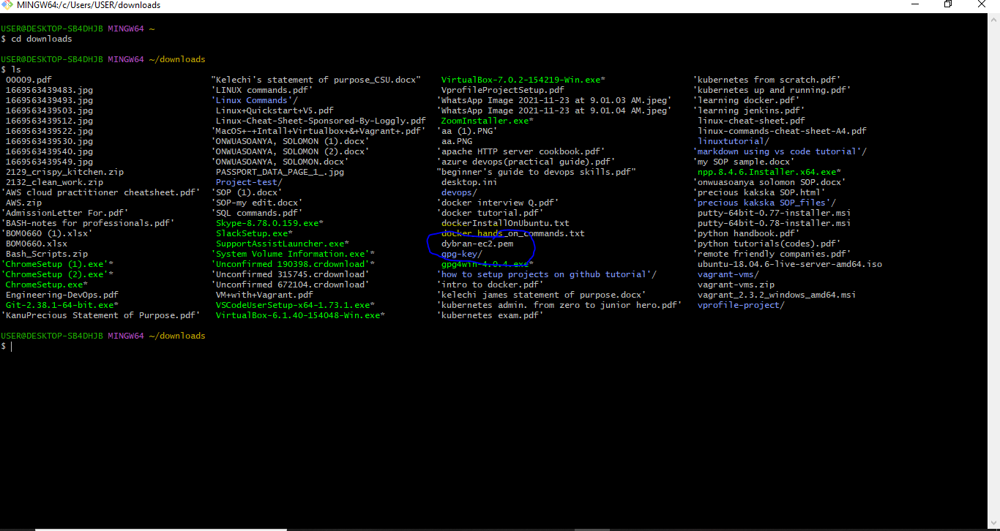

To know how to download PEM File from __AWS__. Click [here](https://intellipaat.com/community/52119/how-to-download-a-pem-file-from-aws).

We connect to the instance from our ubuntu terminal using the command:

```$ ssh -i dybran-ec2.pem ubuntu@54.175.190.127```

This automatically connects to the instance.

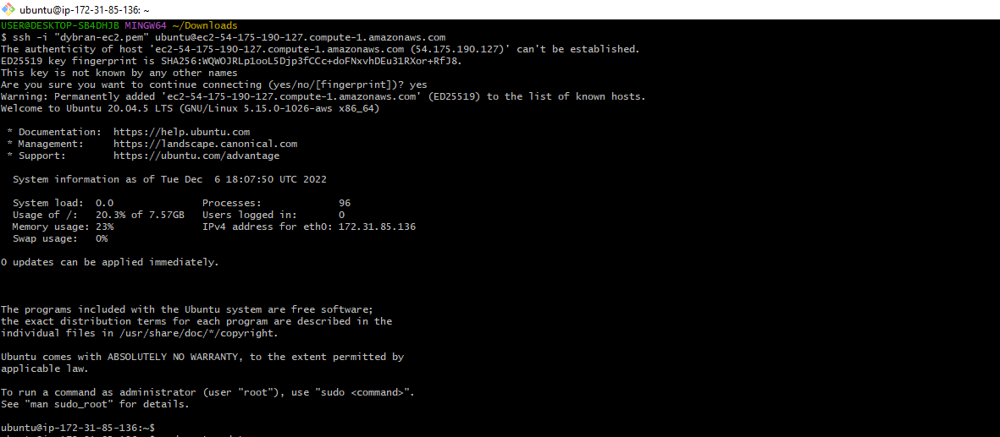

__SETTING UP NGINX WEB SERVER__

To download the nginx web server, we first update the server's package.

```$ sudo apt update```

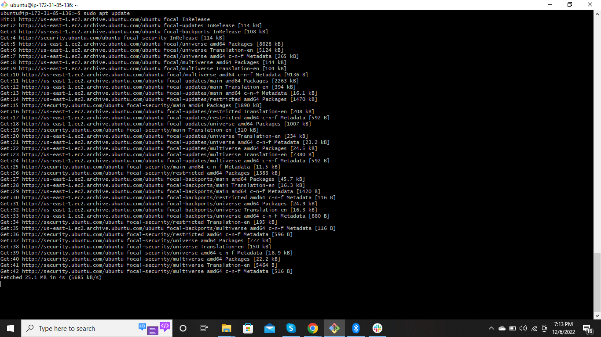

After the update, we then go ahead to install the nginx web server by running:

```$ sudo apt install nginx```

we click on "__y__" to confirm installation.

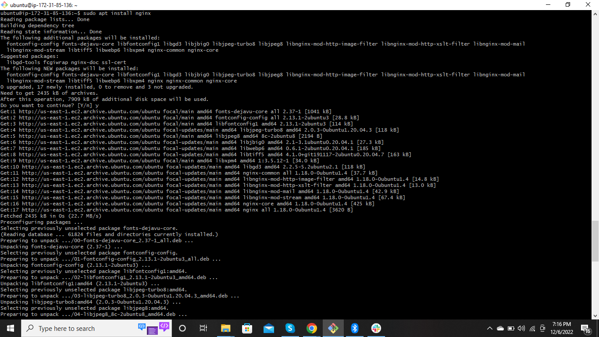

To verify that nginx was downloaded and installed successfully, we run:

```$ sudo systemctl status nginx```

if it shows "__green__" and "__running__", then it was successfully installed.

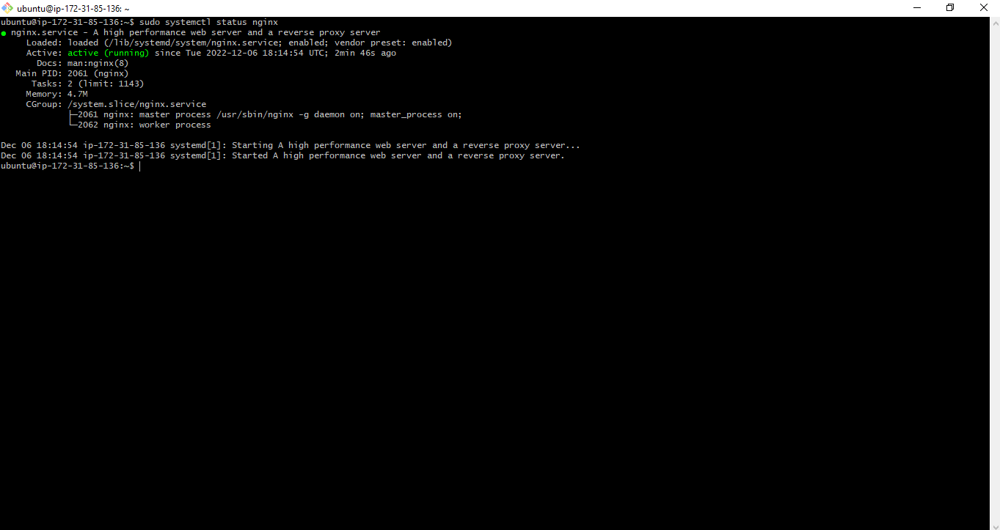

We then go to our instance and set the inbound rules and save

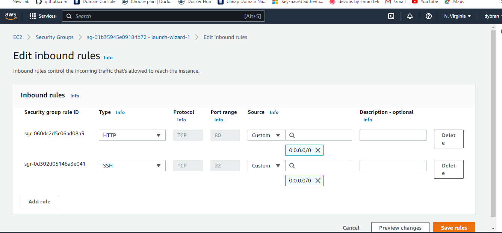

To test how our nginx server responds to requests from the internet, we open our browser and use this url:

```http://<Public-IP-Address>:80```

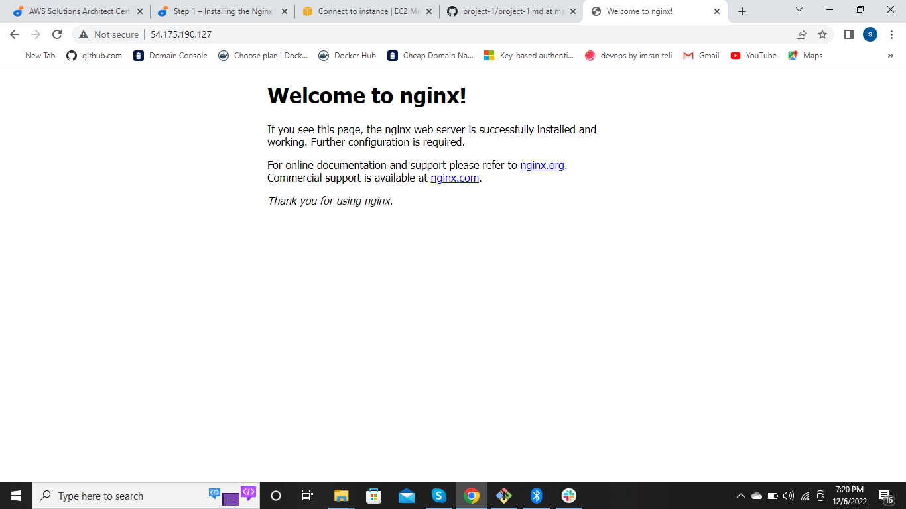

__SETTING UP MYSQL DATABASE__

Now that we have our webserver up and running, we need a __Database Management System(DBMS)__.

To install Mysql server, we run the command:

```$ sudo apt install mysql-server```

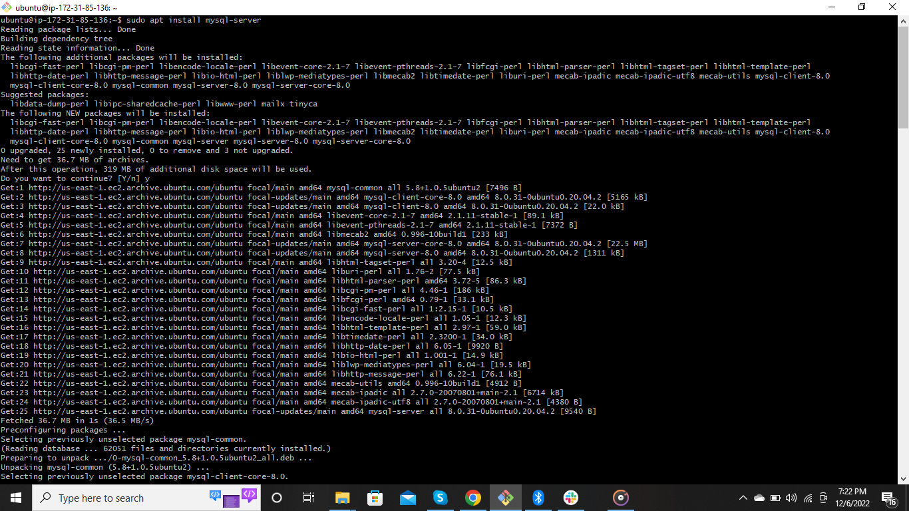

we click on "__y__" to confirm installation.

When installation is done, we log in by running the command:

```$ sudo mysql```

This will connect to the MySQL server as the administrative database user root:

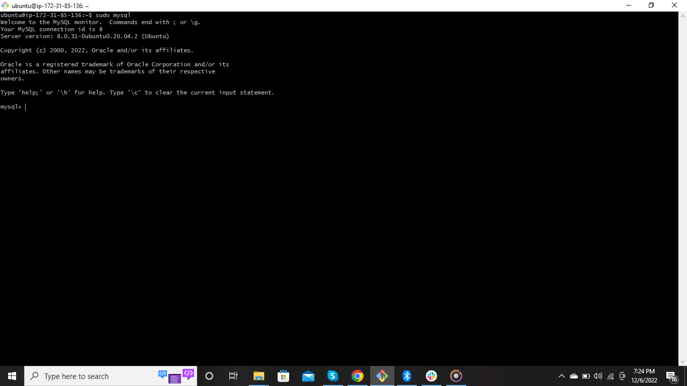

We run a security script that comes pre-installed with MySQL. This script will remove some insecure default settings and lock down access to your database system. Before running the script you will set a password for the root user, using __"mysql_native_password"__ as default authentication method. We choose a user’s password as __"PassWord.1"__.

```mysql> ALTER USER 'root'@'localhost' IDENTIFIED WITH mysql_native_password BY 'PassWord.1';```


We  __"exit"__ the mysql and start the script by running the command:

```$ sudo mysql_secure_installation```

This will ask for password, create password you would want and go ahead and type __"yes"__ to all subsequent prompts.

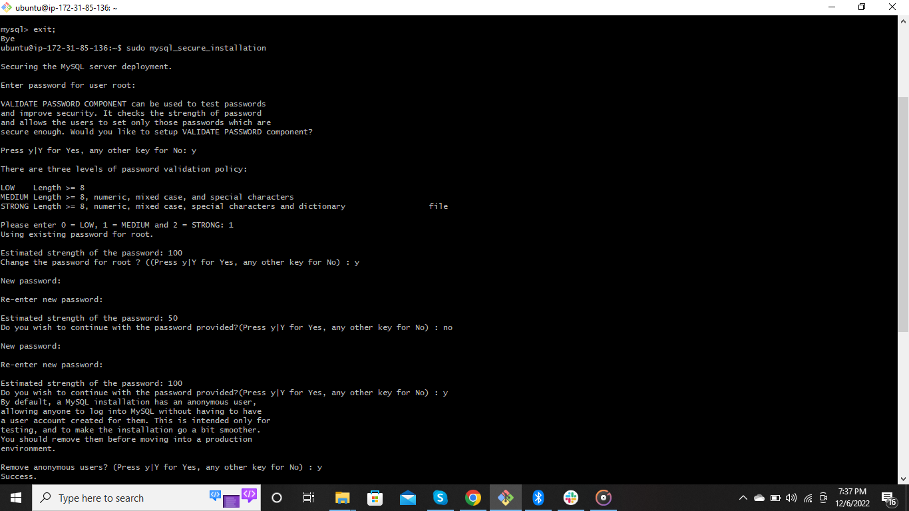

When we are done, we test if we can log into the  mysql by runnimg the command:

```$ sudo mysql -p```

there will be a prompt for you to put in the _password_ you created earlier.

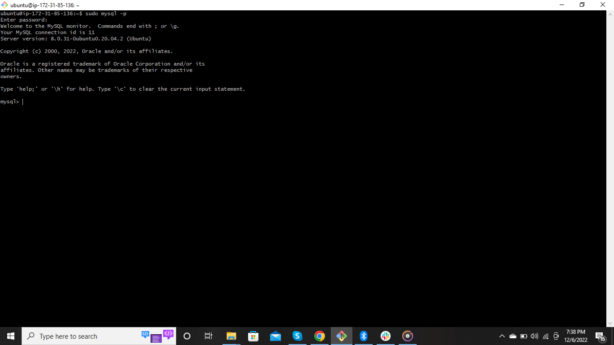

Let us create a database named __"example_database"__ and a user named __"example_user"__, but you can replace these names with different values.

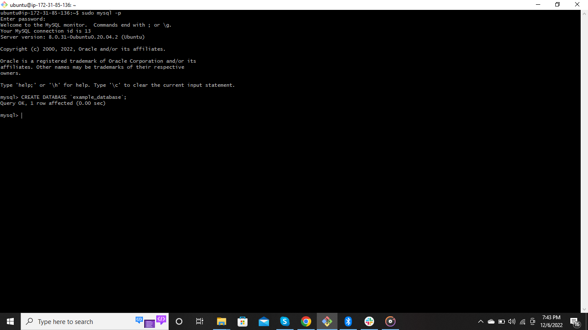

we then create the new user (__example_user__) and grant full priviledges on the database we just created by running the command:

```mysql> CREATE USER 'example_user'@'%' IDENTIFIED WITH mysql_native_password BY '<new-password>';```

we replace __"new-password"__ by the new password we created earlier.

To give this user permission over the datatbase, we run the command:

```mysql> GRANT ALL ON example_database.* TO 'example_user'@'%';```

then __"exit"__.

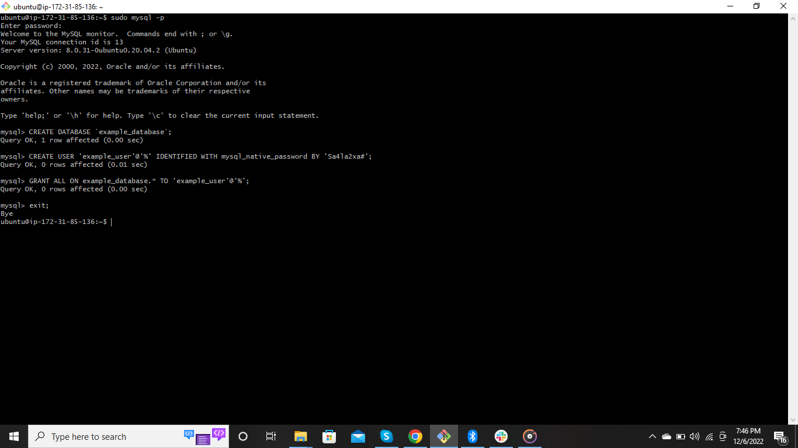

we log into the mysql again with custom user credentials to test if the permissions were granted by running the command:

```$ sudo mysql -u example_user -p```

we put in our password at the prompt.

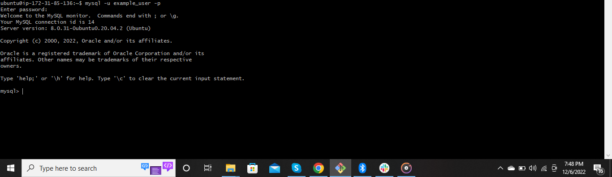

Next, we run the command:

```mysql> SHOW DATABASES;```

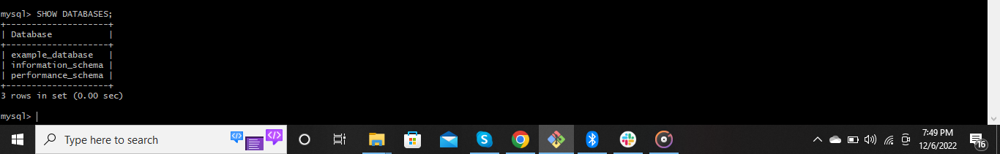

__SETTING UP PHP__

We have the _nginx server_ running for the web server and the _mysql_ to handle the database. we need to install _PHP_ to handle the codes.
To install PHP, we run the command:

```$ sudo apt install php-fpm php-mysql```

we type __"y"__ at the prompt and click__"ENTER"__.

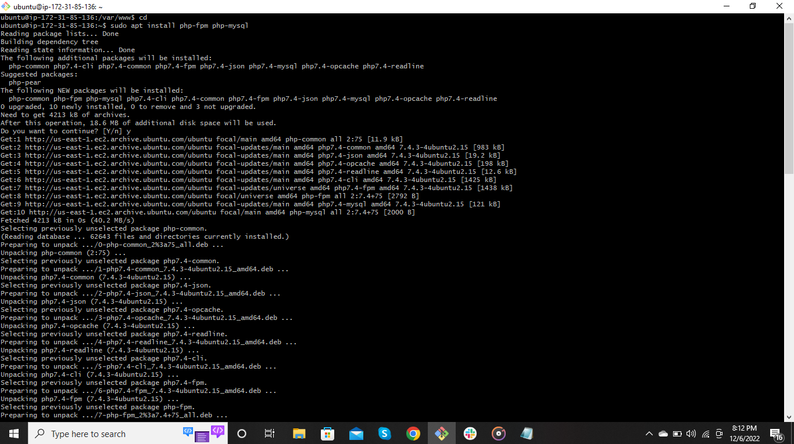

__CONFIGURING NGINX TO USE PHP PROCESSOR__

To set up the nginx to use the PHP processor, we first create a root web directory by creating a directory in __"/var/www/"__.

```$ sudo mkdir /var/www/projectLEMP```

next we assign ownership to the directory

```$ sudo chown -R $USER:$USER /var/www/projectLEMP```

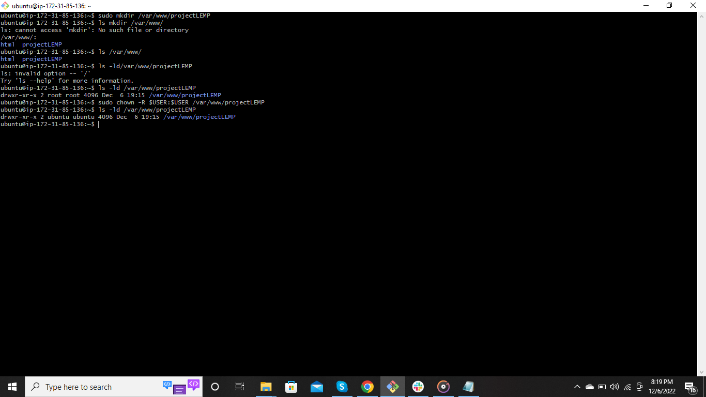

create and open a new configuration file in nginx"s __sites-available__

```$ sudo nano /etc/nginx/sites-available/projectLEMP```

paste in the following:

```server {
    listen 80;
    server_name projectLEMP www.projectLEMP;
    root /var/www/projectLEMP;

    index index.html index.htm index.php;

    location / {
        try_files $uri $uri/ =404;
    }

    location ~ \.php$ {
        include snippets/fastcgi-php.conf;
        fastcgi_pass unix:/var/run/php/php7.4-fpm.sock;
     }

    location ~ /\.ht {
        deny all;
    }

}
```

we click __"CTRL+"x"__ and then __"y"__ then __"ENTER"__.

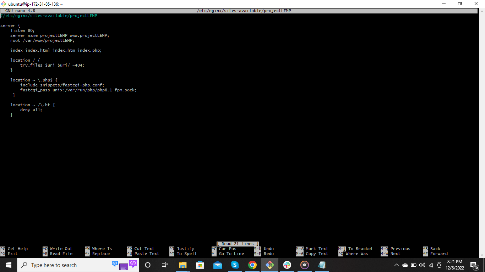

in the above the php _7.4_ version  Make sure to specify the version of the PHP.
To check the PHP version we use the command:

```$ php -v```

To activate the configuration, we link to the configuration file in Nginx’s sites-enabled directory:

```$ sudo ln -s /etc/nginx/sites-available/projectLEMP /etc/nginx/sites-enabled/```

This will instruct the nginx to use the configuration next time it is loaded.
We then run the command:

```$ sudo nginx -t```

we will see the following:

> __nginx: the configuration file /etc/nginx/nginx.conf syntax is ok
nginx: configuration file /etc/nginx/nginx.conf test is successful__

If it displays any errors, we go back and review the configurations.

To disable the default nginx host that is currently configured to listen on port 80

```$ sudo unlink /etc/nginx/sites-enabled/default```

we reload nginx by running the command:

```$ sudo systemctl reload nginx```

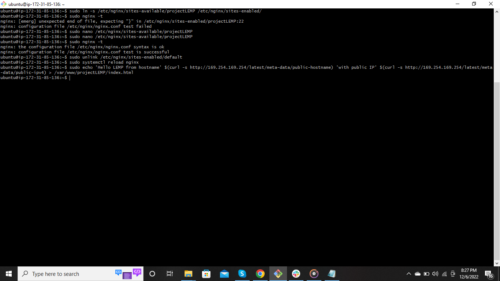

The new website is now active, but the web root __"/var/www/projectLEMP"__ is still empty. 

We create an __"index.html"__ in the __"/var/www/projectLEMP"__ directory:

```
$ sudo echo 'Hello LEMP from hostname' $(curl -s http://169.254.169.254/latest/meta-data/public-hostname) 'with public IP' $(curl -s http://169.254.169.254/latest/meta-data/public-ipv4) > /var/www/projectLEMP/index.html
```

We go to the browser and try to open the URL using IP address

```http://<Public-IP-Address>:80```

We should see the text from the __echo command__. This shows that the nginx site is working as expected.

__TESTING PHP WITH NGINX__

The LEMP stack is completely setup.
To test that the nginx can hand _.php_ files to PHP processor, we create a file __info.php__ in the __"/var/www/PROJECTLEMP"__ 

```$ sudo nano /var/www/projectLEMP/info.php```

and paste the following:
```
<?php
phpinfo();
```
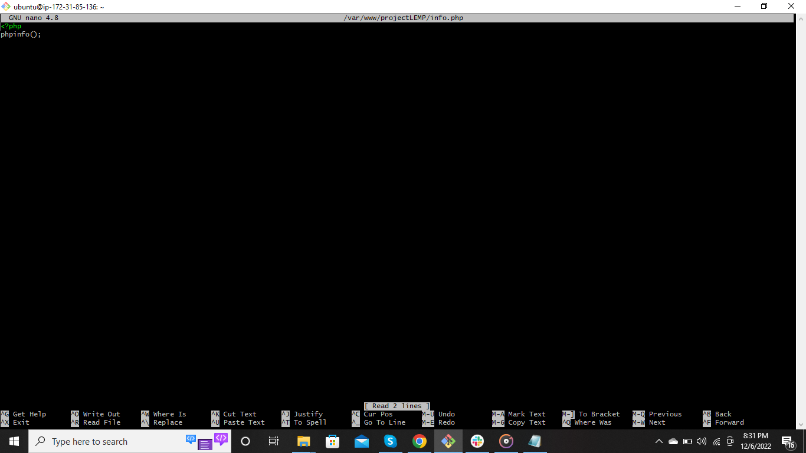

We can now access this by adding __info.php__ to the URL on the browser

```http://<Public-IP-Address>/info.php```

wWe should see a web page containing information about PHP

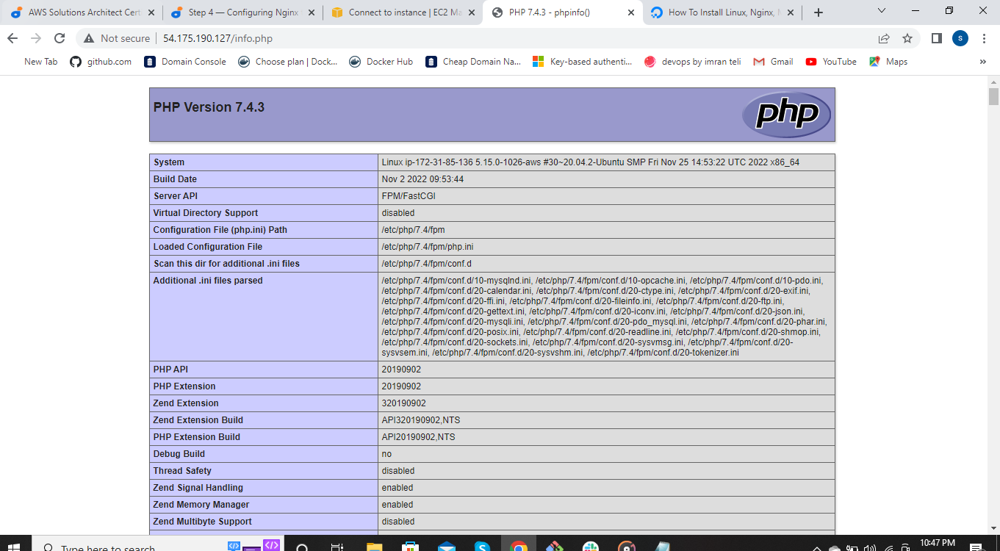

To create a test table, we log into the mysql:

```$ mysql -u example_user -p```

We log in using our password.

Next, we run the command:

```mysql> SHOW DATABASES;```

This will give the following output

```
 Output
+--------------------+
| Database           |
+--------------------+
| example_database   |
| information_schema |
+--------------------+
2 rows in set (0.000 sec)
```

Next, we create a test table named __todo_list.php__

```
mysql> CREATE TABLE example_database.todo_list (
mysql>     item_id INT AUTO_INCREMENT,
mysql>     content VARCHAR(255),
mysql>     PRIMARY KEY(item_id)
mysql> );
```

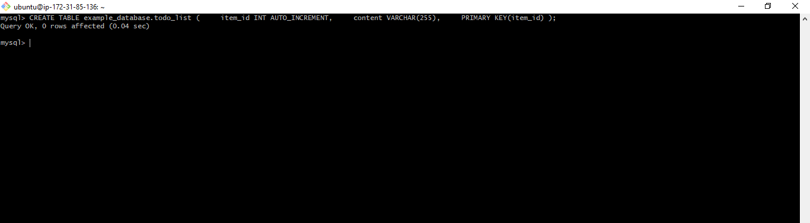

we insert a few rows using the command:

```
mysql> INSERT INTO example_database.todo_list (content) VALUES ("My first important item");
```
and 
```
mysql> INSERT INTO example_database.todo_list (content) VALUES ("another important item");
```
and 
```
mysql> INSERT INTO example_database.todo_list (content) VALUES ("just another important item");
```
and
```
mysql> INSERT INTO example_database.todo_list (content) VALUES ("an important item");
```

we click on __ENTER__ after each of the above commands.

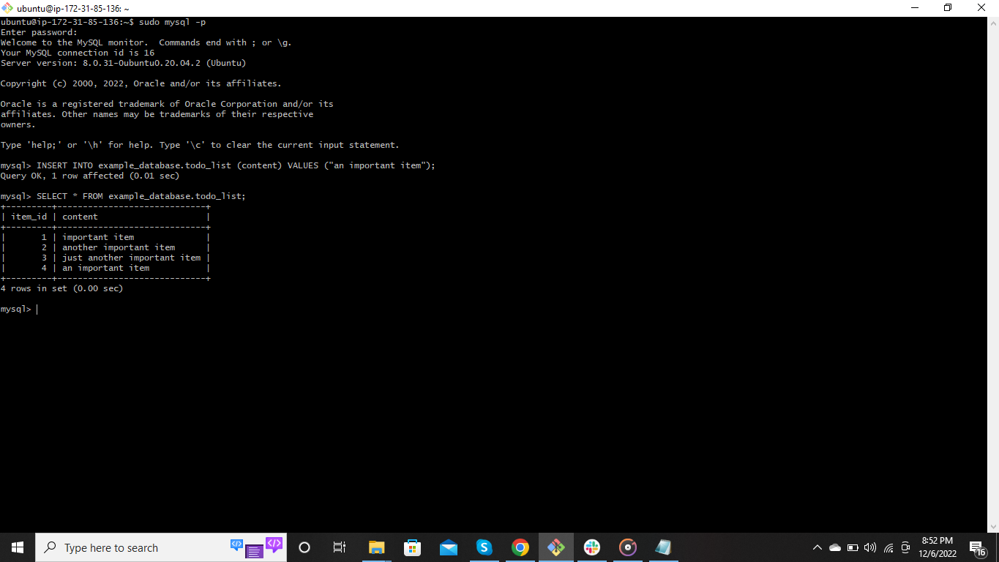

To confirm the values were succesfully stored in the table, we run the command:

```mysql>  SELECT * FROM example_database.todo_list;```

The following output will be displayed.

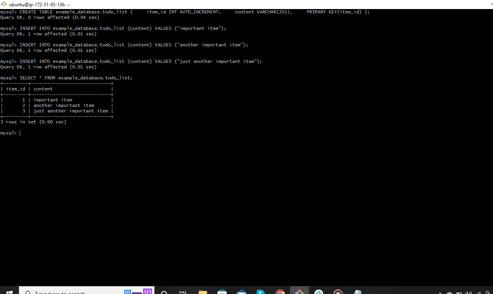

Now we create a PHP script that will connect to mysql:

```$ nano /var/www/projectLEMP/todo_list.php```

we paste the following into the above file:

```
<?php
$user = "example_user";
$password = "password";
$database = "example_database";
$table = "todo_list";

try {
  $db = new PDO("mysql:host=localhost;dbname=$database", $user, $password);
  echo "<h2>TODO</h2><ol>";
  foreach($db->query("SELECT content FROM $table") as $row) {
    echo "<li>" . $row['content'] . "</li>";
  }
  echo "</ol>";
} catch (PDOException $e) {
    print "Error!: " . $e->getMessage() . "<br/>";
    die();
}
```

in the __$password = "password"__, we replace __password__ with our own _password_.

We save and close the file.

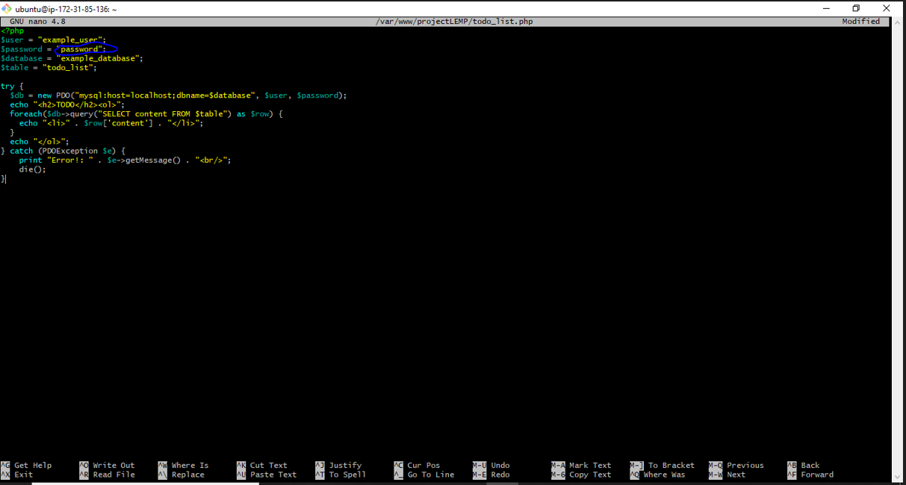

we can now access the page using:

```http://<Public-IP-Address>/info.php```

we should see this display 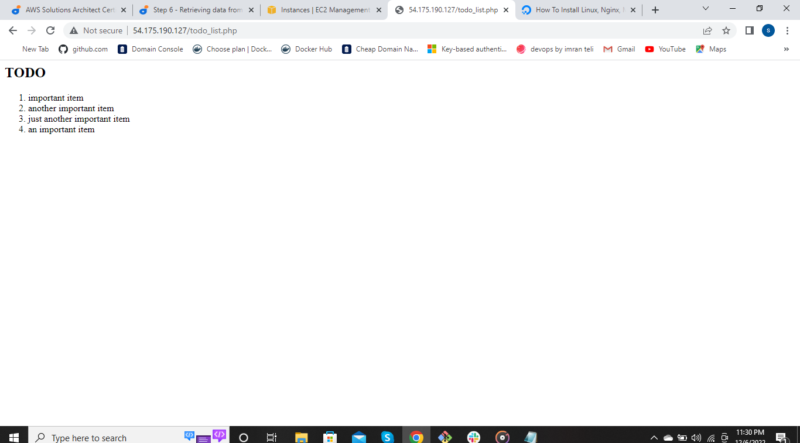

__This means that the PHP Environment can now connect and interact with mysql server__.
